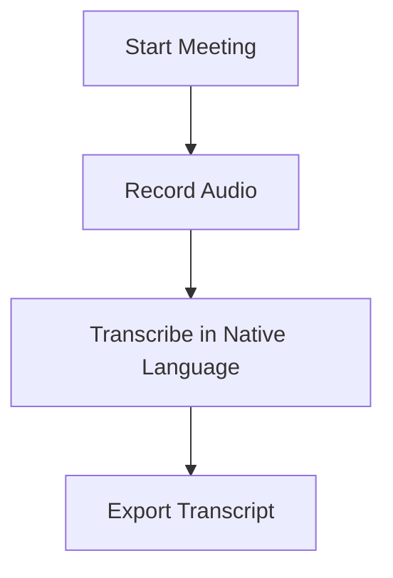

## Overview

NoteX AI empowers your global teams by automating the entire meeting lifecycle. You capture every word, translate across languages, extract action items, and support any format—online, in-person, or hybrid. No more manual notes or lost details.

<Columns cols={3}>
  <Card title="Multilingual Transcription" icon="mic-2" href="#transcription">
    Record and transcribe in 50+ languages with 99% accuracy.
  </Card>
  <Card title="Real-time Translation" icon="globe" href="#translation">
    Enable seamless communication for international teams.
  </Card>
  <Card title="AI Summaries" icon="file-text" href="#summarization">
    Get concise summaries and auto-assigned tasks instantly.
  </Card>
</Columns>

## Automatic Transcription in Multiple Languages

NoteX AI transcribes meetings in real-time across 50+ languages, including English, Spanish, Mandarin, French, and Arabic. You simply start recording, and it handles accents, jargon, and background noise.

<Callout kind="tip">
  Enable speaker identification to attribute lines to individuals automatically.
</Callout>



<Steps>
  <Step title="Connect Platform" icon="plug">
    Link Zoom, Google Meet, or Teams via dashboard.
  </Step>
  <Step title="Select Language" icon="globe">
    Choose from 50+ options in settings.
  </Step>
  <Step title="Record" icon="mic">
    Join meeting and hit record—transcription starts instantly.
  </Step>
</Steps>

## Real-time Translation for Global Conversations

Break language barriers with live translation. You hear and see subtitles in your preferred language during the meeting.

<Tabs>
  <Tab title="English to Spanish" icon="translate">
    Participants speak English; you view Spanish subtitles.
    
    <Image
      src="https://via.placeholder.com/800x400/0b89f5/white?text=Live+Translation"
      alt="Real-time translation interface showing English audio to Spanish text"
      width="800"
      height="400"
    />
  </Tab>
  <Tab title="Mandarin to French" icon="languages">
    Supports tonal languages and complex grammar seamlessly.
  </Tab>
</Tabs>

Integrate via API for custom apps:

<CodeGroup tabs="JavaScript,Python">
  ```javascript
  const notex = require('notex-ai-sdk');
  
  const session = await notex.createSession({
    meetingId: 'mtg_12345',
    targetLang: 'es'
  });
  
  session.on('translate', (text) => {
    console.log(`Translated: ${text}`);
  });
  ```
  ```python
  import notex_ai
  
  session = notex_ai.Session.create(
      meeting_id='mtg_12345',
      target_lang='es'
  )
  
  for translation in session.translations():
      print(f"Translated: {translation}")
  ```
</CodeGroup>

## AI-Powered Summarization and Action Item Extraction

NoteX AI analyzes transcripts to generate bullet-point summaries, highlight key decisions, and extract actionable tasks with assignees.

<Expandable title="Advanced Summary Options" default-open="false">
  Customize with keywords like `urgent` or `@username` for auto-tagging.
</Expandable>

Example summary output:

```json
{
  "summary": "Team discussed Q4 roadmap. Approved feature X.",
  "actions": [
    {
      "task": "Implement login flow",
      "assignee": "@alice",
      "due": "2024-11-15"
    }
  ]
}
```

## Handling All Meeting Formats

NoteX AI adapts to your workflow:

<Tabs>
  <Tab title="Online (Zoom/Teams)" icon="video">
    Auto-join via bot; transcribe with screen sharing support.
  </Tab>
  <Tab title="In-Person" icon="mic">
    Use mobile app to record; upload audio post-meeting.
  </Tab>
  <Tab title="Hybrid" icon="users">
    Combine sources: bot for remote, app for local.
  </Tab>
</Tabs>

<Columns cols={2}>
  <Card title="Get Started" icon="rocket" href="/quickstart">
    Set up in 5 minutes.
  </Card>
  <Card title="API Reference" icon="code" href="/authentication">
    Integrate programmatically.
  </Card>
</Columns>

<Callout kind="success">
  All features available on free tier—upgrade for unlimited storage.
</Callout>