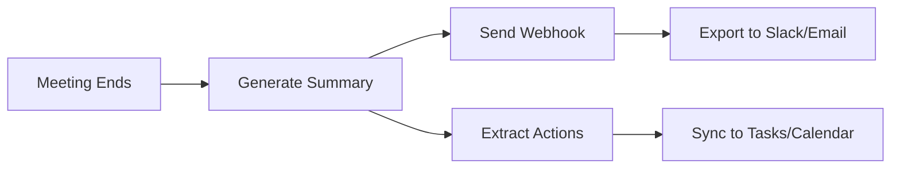

## Overview

NoteX AI integrates seamlessly with popular meeting platforms and productivity tools. You connect it to capture meetings automatically, export summaries, and sync action items. Supported integrations include Zoom, Microsoft Teams, Google Meet for transcription, plus Slack, email, webhooks, calendars, and task managers like Asana or Todoist.

<Columns cols={3}>
  <Card title="Meeting Platforms" icon="video" href="#meeting-integrations">
    Connect Zoom, Teams, and Google Meet to auto-join and transcribe.
  </Card>
  <Card title="Notifications" icon="bell" href="#webhooks">
    Use webhooks for real-time alerts on summaries and actions.
  </Card>
  <Card title="Exports & Sync" icon="share" href="#exports-sync">
    Send outputs to Slack, email, or sync tasks with calendars.
  </Card>
</Columns>

## Meeting Platform Integrations

Set up NoteX AI to join your meetings automatically. Authorize the integration in your NoteX dashboard at `https://dashboard.example.com/integrations`.

<Tabs>
  <Tab title="Zoom" icon="video">
    <Steps>
      <Step title="Authorize Zoom" icon="key">
        In NoteX dashboard, select Zoom and click "Connect". Log in to your Zoom account and grant permissions for meeting access.
      </Step>
      <Step title="Select Meetings" icon="calendar">
        Choose specific meetings or enable auto-join for all scheduled events. NoteX uses your calendar to detect them.
      </Step>
      <Step title="Test Connection" icon="play">
        Schedule a test meeting and verify NoteX joins. Check the dashboard for the first transcript.
      </Step>
    </Steps>
  </Tab>
  <Tab title="Microsoft Teams" icon="microsoft">
    <Steps>
      <Step title="Connect Teams" icon="key">
        Navigate to Microsoft section in integrations. Sign in with your Microsoft account.
      </Step>
      <Step title="Grant Permissions" icon="shield">
        Allow calendar read and meeting join access. Review scopes carefully.
      </Step>
      <Step title="Configure Auto-Join" icon="settings">
        Enable for Teams channels or personal meetings. Test with a quick call.
      </Step>
    </Steps>
  </Tab>
  <Tab title="Google Meet" icon="google">
    <Steps>
      <Step title="Link Google Account" icon="key">
        Click "Connect Google" and authenticate via Google OAuth.
      </Step>
      <Step title="Calendar Sync" icon="calendar">
        Sync your Google Calendar. NoteX scans for Meet links.
      </Step>
      <Step title="Verify" icon="check-circle">
        Join a test Meet and confirm transcription appears in NoteX.
      </Step>
    </Steps>
  </Tab>
</Tabs>

<Callout kind="tip">
  After setup, NoteX AI transcribes in real-time across 50+ languages. View all connected platforms in your dashboard.
</Callout>

## Webhooks for Custom Notifications

Webhooks let you receive instant payloads when a meeting ends, summary generates, or actions extract. Configure them in `https://dashboard.example.com/webhooks`.

<CodeGroup tabs="JavaScript,Python,cURL">
  ```javascript
  // Example webhook payload handler
  app.post('/notex-webhook', (req, res) => {
    const { meetingId, summaryUrl, actions } = req.body;
    console.log(`New summary: ${summaryUrl}`);
    // Send to Slack or database
    res.status(200).send('OK');
  });
  ```
  ```python
  from flask import Flask, request

  app = Flask(__name__)

  @app.route('/notex-webhook', methods=['POST'])
  def webhook():
      data = request.json
      meeting_id = data['meetingId']
      summary_url = data['summaryUrl']
      print(f"Summary ready: {summary_url}")
      return 'OK', 200
  ```
  ```bash
  # Test webhook endpoint
  curl -X POST https://your-webhook-url.com/notex-webhook \
    -H "Content-Type: application/json" \
    -d '{"meetingId": "mtg_123", "summaryUrl": "https://api.example.com/summaries/mtg_123"}'
  ```
</CodeGroup>

Use this `<ParamField>` structure for webhook configuration:

<ParamField path="url" param-type="string" required="true">
  Your secure HTTPS webhook endpoint.
</ParamField>

<ParamField query="secret" param-type="string" required="false">
  Optional HMAC signature secret for verification.
</ParamField>

## Exporting Summaries and Syncing Actions

Export meeting outputs directly.

<Columns cols={2}>
  <Card title="Slack & Email" icon="message-circle" horizontal>
    Post summaries to channels or send via email. Configure in exports tab.
  </Card>
  <Card title="Task Sync" icon="check-square" horizontal>
    Push actions to Asana, Todoist, or Google Calendar. Map fields like due dates.
  </Card>
</Columns>



<Expandable title="Advanced Sync Options" default-open="false">
  For calendars, map action items to events with reminders. Use Zapier for unsupported tools.
</Expandable>

<Callout kind="success">
  Integrations update automatically with NoteX releases. Check `https://docs.example.com/changelog` for new connections.
</Callout>